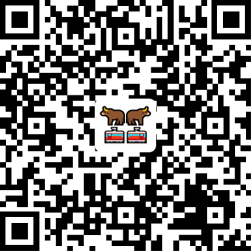
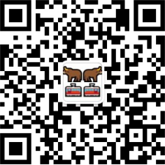
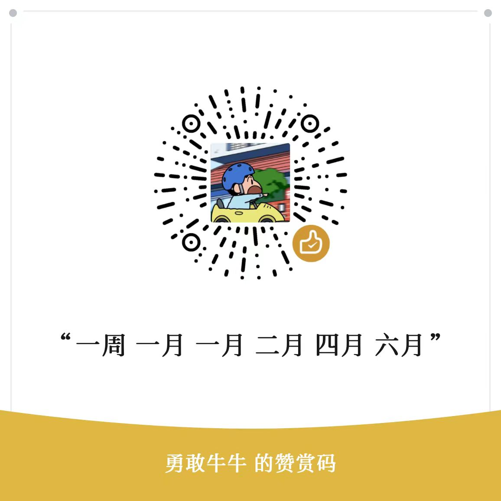

# 一、相关信息

## 1. 二维码集合

|                                                     [QQ交流群](./img/qq-g.png)                                                     |   [微信公众号](./img/wx-qr-code.png)    |       ----->       |      [热心捐赠](./img/give_qr.jpg)      |
|:-------------------------------------------------------------------------------------------------------------------------------:| :----------------------------------------------------------: | :----------------: | :----------------------------------------------------------: |
|  |  | **望大家多多支持** |  |

## 2. 相关链接

> 社区地址：<a href="https://www.nnbs.cc" target="_blank">点击进入</a>
> 
> APP下载：<a href="https://wwxz.lanzouw.com/b0aug8sjc" target="_blank">点击下载</a>  (密码：9alc) 或者直接在github上[Releases](https://github.com/Szymou/NNBS/releases)下载
> 
> GITHUB：<a href="https://github.com/Szymou/NNBS" target="_blank">点击进入</a>

# 二、使用说明

## 1. 在线监控(限时体验)

> ### 重要提示：【在线监控】和APP中的【票票监控】属于不同的功能服务，【在线监控】当前限时体验！！！

### ①在牛牛巴士APP中激活在线账号

> 设备还在有效期才允许在APP激活，设备过期的请移步社区在相关帖子按要求回复设备ID即可。
>
> 默认账号：设备ID
>
> 默认密码：123456

|  |  |  |
| ---------------------------------------------------- | ---------------------------------------------------- | ---------------------------------------------------- |

### ②获取机器人

> 手机打开TINGTALK，**创建团队**（创建内部群需要满足该条件）

|  |  |  |  |
| -------------------------------------------------- | -------------------------------------------------- | -------------------------------------------------- | -------------------------------------------------- |

> 电脑打开TINGTALK，**创建机器人**

### ③设置机器人关键词：NNBS

> 勾选"自定义关键词"

### ④后台接入机器人 [点击跳转后台](https://web.nnbs.cc/)

### ⑤添加监控数据

## 2. 脚本使用

暂无

## 3. App功能使用

暂无
