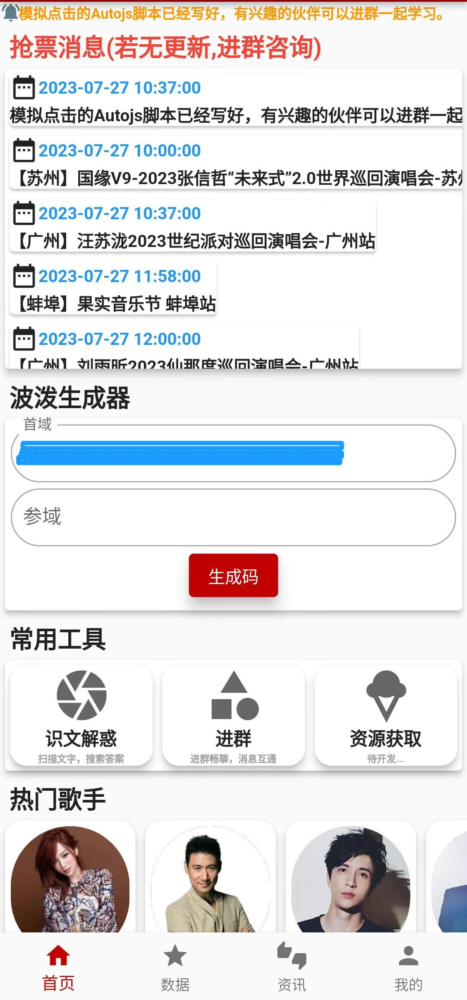
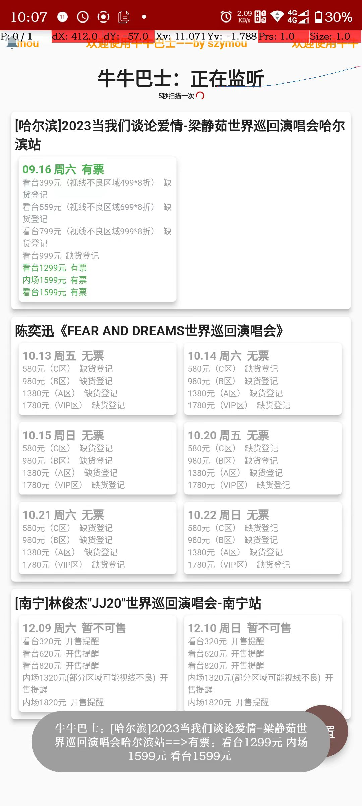
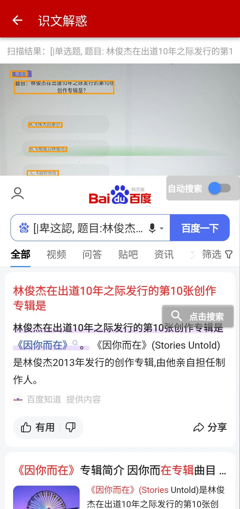
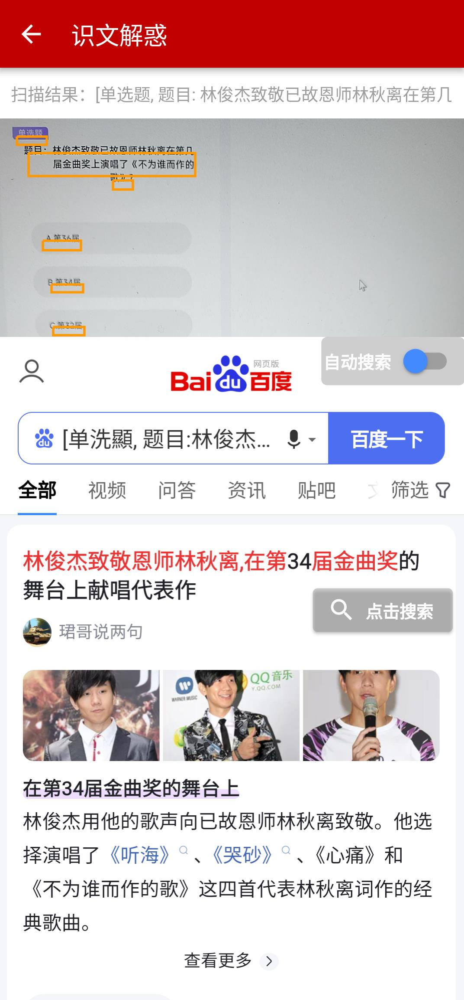
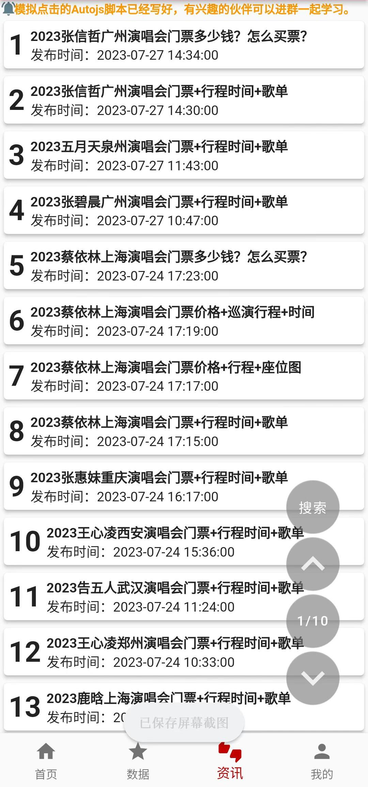
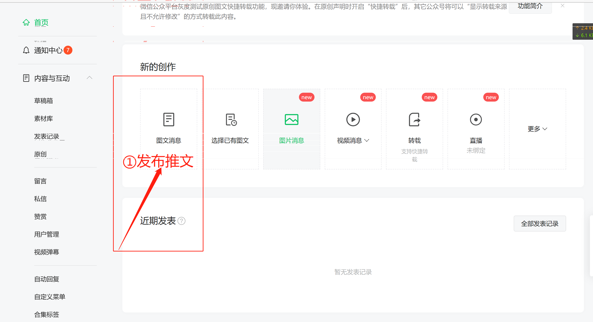
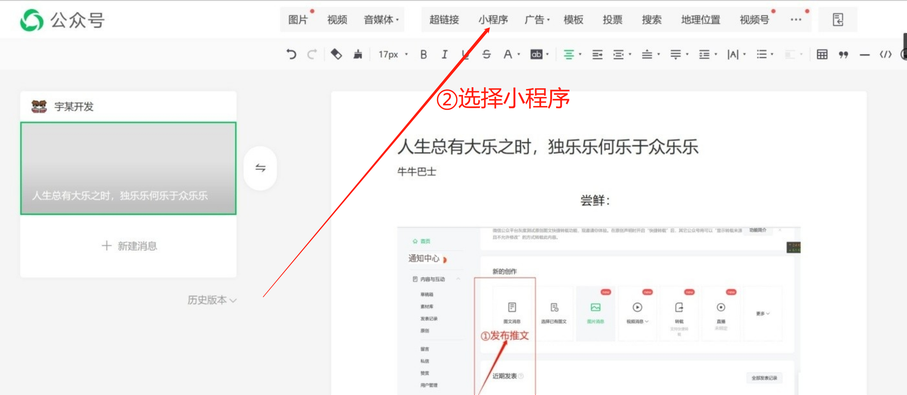
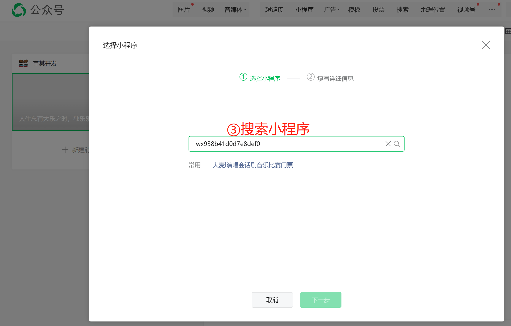
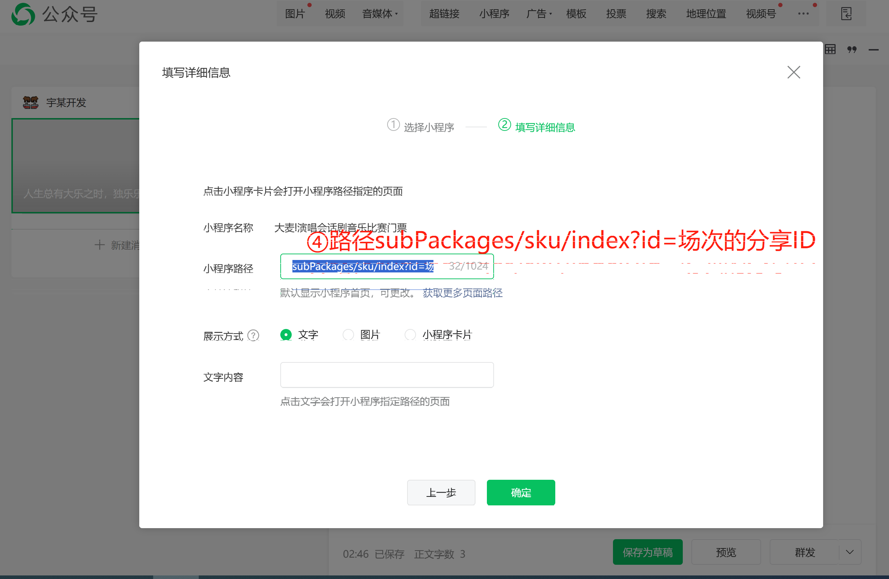

# 在线监控1009

[立即体验](OnlineMonitor.md)，独立搭建通知群。

# NNBS

`欢迎star本项目,本项目将持续为大家收集并整理最新票圈消息。APP、脚本不断更。`

`如需要技术和最新技术消息，可以通过app进Q群即可，群中有最新版本脚本。`
[点击获取app历史版本](https://github.com/Szymou/NNBS/releases)

~~`当然，也可以加v：nnbs_119，记得注明来源，进vx群一起讨论购票`~~`（票贩子勿扰，各自有各自的圈子，别来污染，都不容易。）`

> - 鉴于之前没有一个百分百开放发言的地方让大家交流(牛老板、牛脚本、科技大佬、演唱会粉丝等)，所以开了个[牛牛巴士社区](https://www.nnbs.cc)
> 
> - 有何功能可以详细看看社区里面的新人贴。由于站点会偶尔不稳定，注册功能只开放几天，先实验下。社区地址：https://www.nnbs.cc

## 牛牛巴士
简要：《牛牛巴士》是一款可以提供抢票消息、波泼码生成、JJ20扫文识字搜答案等功能的APP

### 功能：
1. **定时抢票消息**

2. **JJ20答题辅助：扫描文字，自动搜索答案**

3. **生成二维码功能(07.26新增)，方便波泼码的生成(不过现在波泼码已失效，新方案得再等等)**

4. **提供热门资讯、明星、赛事的等功能**

   |  |       |  |  |
   | ---------------------------------------------------------- |-----------------------------------------------------------------| ------------------------------------------------------------ | ------------------------------------------------------------ |
   |   |  |                                                              |                                                              |

   

## 脚本AUTOJS

最新脚本在Q群，Q群在[APP](https://github.com/Szymou/NNBS/releases)有入口。

### 日志记录

**10.10记录：1009[在线监控](https://www.nnbs.cc/d/1941/15)上线，欢迎体验.**

**09.30记录：9月份的脚本都在APP下载功能.**

**08.30记录：新增0830[单场次]回流检测脚本.**

**08.30记录：0829回流检测脚本优化：1.内测二次回流； 2.[我知道了]按钮自动点击； 3.指定周几周几；.**

**08.29记录：0829自动抢购脚本适配dm8.6.9.**

**08.27记录：新增0827回流检测脚本，请尝鲜.**

**08.05记录：1.最新脚本正在测试：自动检测并点击'努力刷新'按钮；2.目前流传有几种方案：①[方案1步骤](https://mp.weixin.qq.com/s?__biz=MzI1NTY2MzUyMg==&mid=2247483659&idx=1&sn=4330153643ba705aeeb66e051e2e9110&chksm=ea33cdc6dd4444d0e0e4c7eccea143979790e8d4b5ccdce402ee8c3472d7d8bc1071415139dd#rd)②UA伪装成weixin，加载脚本**

|  |      |      |      |
| ----- | ---- | ---- | ---- |

**07.31记录：新增0731滑块模拟滑动脚本，请尝鲜.**

**07.30记录：在牛牛巴士APP中添加下载脚本功能；还有一件事：脚本被搬运了，还被拿去卖钱，心痛。**

**07.29记录：大麦更新8.5.8，脚本已更新适配**

**07.28记录：测试滑块模拟滑动脚本**

**07.27记录：0秒之后按钮会变"立即订购"，继而一瞬间又变回"立即预约"按钮，说明APP，在0秒的时候还会再次请求服务器时间校正，所以`0727版本`添加了抖动。**

**07.26记录：大麦在线更新，`波泼码`不再行，间断性可以；如果能进去，那就不要出来，等到时间开始。**

|  |
|---------------------------------------------------------------------|

### Tips：抢票是概率事件，不要过度依赖依赖脚本，很多情况都取决于个人账号。
